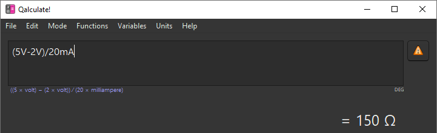
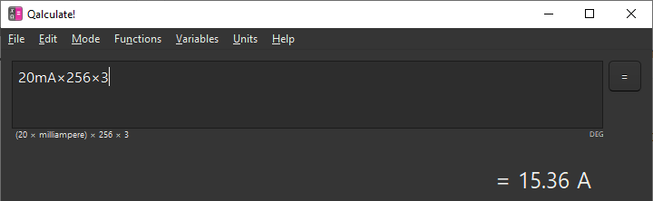
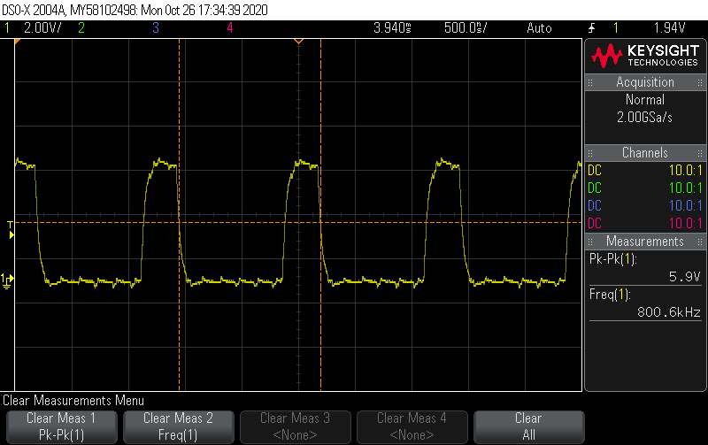
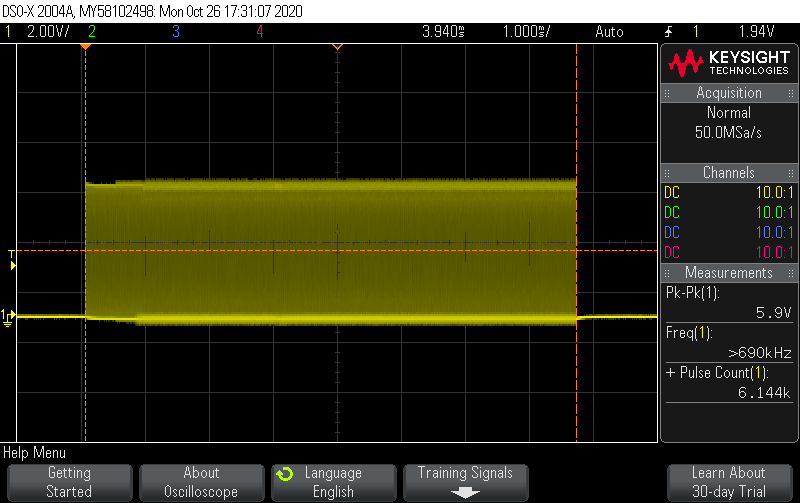
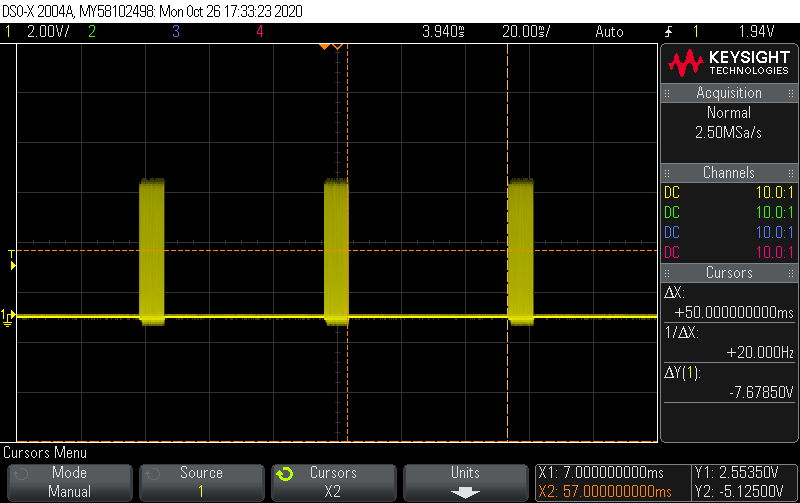
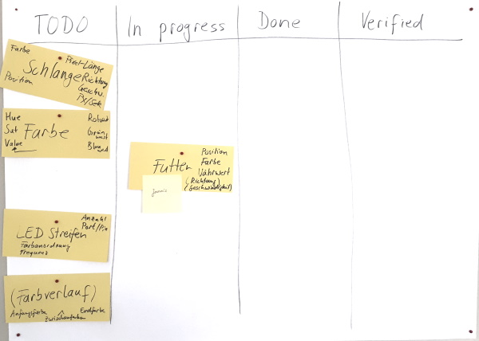

# Animierte-LED-Leuchtschlange
Dieses Projekt ist entstanden als Praktikum eines Schülers aus Schramberg bei der Firma [Mitutoyo CTL Germany GmbH](https://mitutoyo-ctl.de). Einige Präsentationen zur Elektronik stammen von der Webseite [Roboter-Basteln](https://roboter-basteln.de/).

Es geht darum, animierte Schlangen zu programmieren, die auf einem WS2812 Leuchtstreifen darzustellen. Die Schlangen fressen Futter und werden länger.

## Montag, 26.10.2020

Wir haben begonnen mit einer Vorstellungsrunde und der [Firmenpräsentation](praesentationen/Firmenpräsentation.pptx) gezeigt. Danach hat unser Student die Projektidee und eine mögliche Lösung vorgestellt.

Wir haben das [Steckbrett](praesentationen/Steckbrett.pptx) erklärt und den [Aufbau von LEDs ](praesentationen/LED%20-%20Aufbau.pptx) sowie deren [Schwellenspannung](praesentationen/Diode%20-%20Schwellenspannung.pptx) besprochen.

Unsere erste Schaltung: wir bringen eine LED zum Blinken. Unsere rote LED braucht ca. 2V Spannung. Der Arduino liefert 5V. Bei einem Strom von 20mA für die Leuchtdiode ergibt sich ein Vorwiderstand von (5V-2V)/20mA = 150Ω.  Für solche Berechnungen eignet sich der Taschenrechner [Qalculate](https://qalculate.github.io/). Der kann nämlich mit Einheiten rechnen und liefert das Ergebnis gleich mit der passenden Einheit.



```cpp
// LED blinken lassen

// Diese Methode wird einmal ausgeführt, wenn der Arduino gestartet wird
void setup() {
  // Anschluss (Pin) 6 soll als Ausgang verwendet werden,
  // d.h. man kann dort die Spannung an- oder ausschalten.
  pinMode(6, OUTPUT);  
}

// Diese Methode wird immer hintereinander ausgeführt.
void loop() {
  // Die Spannung an Pin 6 soll hoch sein (d.h. 5V)
  // Sofern der Stromkreis geschlossen ist, wird dann auch ein Strom fließen, die LED leuchtet
  digitalWrite(6, HIGH);

  // 1000 ms warten = 1 Sekunde
  delay(1000);         

  // Die Spannung soll niedrig sein (d.h. 0V)
  // Ohne Spannung fließt auch kein Strom, d.h. die LED geht wieder aus
  digitalWrite(6, LOW);

  // 1000 ms warten = 1 Sekunde
  delay(1000);
}

```

Im nächsten Schritt haben wir die LED mit einem PWM-Signal angesteuert, um die Helligkeit gezielter zu regeln. Dieses Verfahren wird auch in den WS2812 LEDs angewendet, um die Helligkeit zu regeln.  Das Signal haben wir uns auf dem Oszilloskop angeschaut.

```cpp
// Helligkeit einer LED regeln

// Diese Method wird einmal ausgeführt, wenn der Arduino gestartet wird
void setup() {
  // Anschluss (Pin) 6 soll als Ausgang verwendet werden,
  // d.h. man kann dort die Spannung an- oder ausschalten.
  pinMode(6, OUTPUT);  
}

// Diese Methode wird immer hintereinander ausgeführt.
void loop() {
  for(int helligkeit=0; helligkeit<256; helligkeit++)
  {
    // PWM Signal mit einer bestimmten Pulsweite einschalten
    // Die Pulsweite bestimmt die Helligkeit der LED
    // 0 = die Spannung ist nie an
    // 128 = die Spannung ist in 50% der Zeit an
    // 255 = die Spannung ist immer an
    analogWrite(6, helligkeit);
    
    // 20 ms warten, damit wir auch Zeit haben, die Änderung zu sehen
    delay(20);
  }
}
```

Wir haben uns kurz über [Lichtmischung](praesentationen/Licht%20mischen.pptx) informiert, da eine WS2812 LED intern aus drei einzelnen LEDs besteht. Über die additive Farbmischung werden aus den drei Grundfarben Rot (R), Grün (G) und Blau (B) sämtliche Farben gemischt. Ein Beispiel zeigt eine mögliche Farbmischung:

```cpp
#include <Adafruit_NeoPixel.h>

// Ein Objekt namens "pixels", mit dem wir später auf die LEDs zugreifen
// 10 = Anzahl der LEDs 
// 6 = Pin, an dem die Lichtschlange angeschlossen ist
Adafruit_NeoPixel pixels(256, 6, NEO_GRB | NEO_KHZ800);

void setup() {
  pixels.begin();
  // Zeigt die LEDs in den Farben an, wie sie eingestellt wurden.
  // Hier wurde nichts eingestellt, also sind zunächst alle aus.
  pixels.show();
}

// Diese Methode wird immer hintereinander ausgeführt.
void loop() {
  for (int i=0; i<256; i++)
  {
    // Farbe von Pixel i einstellen
    // Rot = 255 (immer an)
    // Grün = i (nimmt zu)
    // Blau = 255-i (nimmt ab)
    pixels.setPixelColor(i, 255, i, 255-i);

    // anzeigen
    pixels.show();
  }
}
```

Bei diesem Programm haben wir festgestellt, dass es nicht möglich ist, alle LEDs gleichzeitig leuchten zu lassen. Das liegt daran, dass der Strom sehr hoch ist und unser Netzteil diesen Strom nicht liefern kann. Wenn alle LEDs weiß leuchten würden, müsste unser Netzteil einen Strom von 256 LEDs * 3 Farben/LED * 20 mA/Farbe = 15,36 A liefern. Unsere beiden Netzteile liefern jedoch maximal 5A. Beim einen sinkt dann die Ausgangsspannung, das andere schaltet ab.




Mit diesem Wissen konnten die Schüler selbst experimentieren und andere Farbverläufe, Blinklichter u.ä. entwerfen.

Auch dieses Signal haben wir uns auf dem Oszilloskop angeschaut. Die erste Beobachtung betraf die Impulsdauer. Es gab kurze und lange Impulse. Wir haben angenommen, dass die kurzen Impuls einer 0 entsprechen und die langen Impulse einer 1, d.h. dass die Daten bitweise übertragen werden. Die Frequenzmessung ergab eine Frequenz von ca. 800 kHz, wie wir es auch beim Anlegen des Objekts angegeben haben (`NEO_KHZ800`).



Insgesamt gab es 6144 Impulse (Pulse Count). Dies entspricht der Anzahl der LEDs * Anzahl der Farben pro LED * Anzahl der Helligkeitsstufen. Hier also 256 LEDs * 3 Farben/LED * 8 Helligkeitsstufen/Farbe = 6144.



Ebenfalls gut zu beobachten war die Pause (`delay(50);`) bis zur nächsten Aktualisierung der Anzeige (ΔX). 




Um ein besseres Verständnis für die Programmiersprache C++ aufzubauen, haben wir uns die Geschichte der Programmiersprachen von [Assembler bis C](praesentationen/Assembler%20bis%20C.pptx). Da unser Programm objektorientiert arbeiten soll, haben wir uns das auch Thema [Objektorientierung](praesentationen/Objektorientierung%20C++.pptx) angeschaut. So können wir später hoffentlich sehr einfach neue Schlangen erstellen, die sich dann selbst einigermaßen intelligent verhalten.

## Dienstag, 27.10.2020

Wir haben das Thema Objektorientierung nochmal wiederholt und uns angeschaut, auf welche Arten in C++ Objekte erzeugt werden können. Wir haben bemerkt, dass Objekte auf dem Stack oder auf dem Heap angelegt werden können. Auf dem Stack wurden die Adressen mit jedem neuen Objekt kleiner, auf dem Heap mit jedem neuen Objekt größer. Wir haben außerdem festgestellt, dass unser Objekt vom Typ Quader 14 Bytes Speicherplatz braucht, nämlich 4 Bytes für die Höhe (`float`), 4 Bytes für die Länge (`float`), 4 Bytes für die Breite (`float`) und 2 Bytes für die Bestellnummer (`int`).

Das Anlegen von Objekten auf dem Stack erfolgt direkt durch Aufruf des Konstruktors (z.B. `Quader a(1,2,3);`). Das Anlegen von Objekten auf dem Heap erfolgt mit dem Schlüsselwort `new` sowie der Klasse, aus der ein Objekt erzeugt werden soll. Zusätzlich brauchen Objekte auf dem Heap noch ein `*` vor dem Namen. Insgesamt also `Quader *b = new Quader(1,2,3);`. Einen weiteren Unterschied gibt es beim Löschen der Objekte. Objekte auf dem Stack werden beim Verlassen des Scopes (`{}`) zerstört. Objekte auf dem Heap müssen manuell durch Angabe von `delete` zerstört werden. Der folgende Code zeigt ein Beispiel:

```cpp
#include "Quader.h"

void setup() {  
  Quader stack(1.0, 2.0, 3.0);
  Quader *heap = new Quader(1.0, 2.0, 3.0);
  
  Serial.begin(9600);
  Serial.println((int)&stack);
  Serial.println((int)heap);
  Serial.println(stack.hoehe);
  Serial.println(heap->hoehe);
  
  delete heap;
}

void loop() {
}
```

Nach dem zugegeben schwierigen Ausflug durch die Möglichkeiten der Objektorientierung in C++ haben wir uns angeschaut, wie man viele Objekte von der gleichen Sorte verwalten kann. Dies geht mit Feldern (Arrays) oder mit Vektoren. Die Größe eines Arrays kann nur einmal angegeben werden und bleibt dann fest. Die Größe eines Vektors kann sich verändern. Im folgenden Code wird beides verwendet:

```cpp
#include <ArduinoSTL.h>
#include "Quader.h"

#define QUADER_COUNT 10

void setup() {
  Serial.begin(9600);
  // Arrays / Felder
  Quader *quaders[QUADER_COUNT]; 
  for(int i=0; i<QUADER_COUNT; i++)
  {
    quaders[i] = new Quader(1.0, 2.0, 3.0);
    Serial.println(quaders[i]->volumen());
  }

  // Vektor
  std::vector<Quader*> v;
  v.push_back(new Quader(1.0, 2.0, 3.0));
  v.push_back(new Quader(2.0, 3.0, 4.0));
  Quader *q = v[1];
  Serial.println(q->volumen());
}

void loop() {
}
```

### Requirements Engineering

Im Folgenden haben wir uns mit der Anforderungsanalyse (engl. Requirements Engineering) beschäftigt. Wir haben festgestellt, dass man bei einem objektorientierten Ansatz einfach eine Person erzählen lassen kann, wie das Produkt funktioniert. Aus dieser Beschreibung suchen wir anschließend die Substantive (Hauptwörter) heraus. Diese Hauptwörter sind Kandidaten für Klassen. Ebenso suchen wir aus der Beschreibung Verben (Tunwörter) heraus. Diese Tunwörter sind Kandidaten für Methoden oder Funktionen.

Im Falle unserer Leuchtschlange haben wir identifiziert:

* Farbe
* Schlange
* Futter
* LED Streifen
* Farbverlauf

sowie

* fressen
* leuchten
* wachsen
* bewegen

Wir haben kurz darüber diskutiert, dass diese Beschreibung wahrscheinlich unvollständig ist, weil es unterschiedliche Kategorien von Wissen gibt:

* bewusstes Wissen, d.h. das Wissen ist vorhanden und uns ist klar, dass wir es wissen
* unbewusstes Wissen, d.h. das Wissen ist vorhanden, aber uns ist gerade nicht klar, dass wir es wissen
* bewusstes Nichtwissen, d.h. das Wissen ist nicht vorhanden, aber uns ist immerhin klar, dass wir eine Wissenslücke haben
* unbewusstes Nichtwissen, d.h. das Wissen ist nicht vorhanden, und uns ist nicht einmal klar, dass wir eine Wissenslücke haben

Wenn wir eine Person befragen, wie etwas funktioniert, werden wir höchstens die bewussten Teile erfassen können. An die unbewussten Dinge wird die Person nicht denken und uns demnach auch nicht erklären. Der Programmierer muss daher durch geschicktes Nachfragen dieses unbewusste Wissen oder Nichtwissen ans Tageslicht bringen.

### Programmdesign

Zu den ermittelten Klassen konnten wir dann überlegen, welche Eigenschaften die Klasse braucht, damit sie später funktioniert. Zum Beispiel braucht die Schlange:

* eine Länge in Pixeln. Wenn sie wächst, erhöht sich diese Länge.
* eine Richtung, in die sie läuft. Auf einem eindimensionalen Leuchtstreifen kann sie nur nach links oder rechts laufen.
* eine Geschwindigkeit in Pixeln/Sekunde. Weil es schnelle und langsame Schlangen geben könnte.
* eine Farbe, damit man zwei Schlangen voneinander unterscheiden kann.
* eine Position auf dem Leuchtstreifen, wo sich der Kopf der Schlange gerade befindet.

Dieses Prinzip haben wir auf andere Klassen angewandt und so ganz viele Eigenschaften ermittelt. Diese Eigenschaften haben wir dann programmiert.

Im nächsten Schritt müssen wir dann die Methoden den Klassen zuordnen, so dass die Objekte sich auch verändern und etwas tun.

### Taskboard

Damit wir den Überblick nicht verlieren, haben wir alle zu programmierenden Klassen aufgeschrieben und auf ein Taskboard gepinnt. So konnten wir nachverfolgen, wie weit unser Projekt gerade fortgeschritten ist.

Die Aufgaben konnten sich in folgenden Zuständen befinden: 

* Todo (muss noch erledigt werden)
* In progress (ich arbeite gerade dran)
* Done (es ist erledigt, muss aber noch geprüft werden) 
* Verified (ist überprüft)



### Farben umrechnen

Der HSV-Farbraum ist ganz geschickt, um einen Farbverlauf zu erzeugen. Der LED Streifen braucht die Angaben für die einzelnen LEDs aber in RGB. Dafür haben wir im Internet eine Umrechnung gesucht und in folgender Klasse umgesetzt (Datei `Farbe.h`, verwendet mit `#include "Farbe.h"`):

```cpp
typedef struct {
    double r;       // a fraction between 0 and 1
    double g;       // a fraction between 0 and 1
    double b;       // a fraction between 0 and 1
} rgb;

typedef struct {
    double h;       // angle in degrees
    double s;       // a fraction between 0 and 1
    double v;       // a fraction between 0 and 1
} hsv;


class Farbe{
  public:
    byte hue;
    byte saturation;
    byte value;
    
    // Konstruktor mit Angaben
    Farbe(byte h, byte s, byte v){
      this->hue = h;
      this->saturation = s;
      this->value = v;
    }


    // Farbe ohne Angaben: soll schwarz erzeugen
    Farbe()
    {
      this->hue = 0;
      this->saturation = 0;
      this->value = 0;
    }

    uint32_t umrechnen(){
      hsv in = hsv{this->hue/255.0*360, this->saturation/255.0, this->value/255.0};
      rgb out = hsv2rgb(in);
      long r = (byte)(out.r*255);
      long g = (byte)(out.g*255);
      long b = (byte)(out.b*255);
      return (r<<16) | (g<<8) | b;   
  }

  private:
    // Quelle: https://stackoverflow.com/questions/3018313/
    rgb hsv2rgb(hsv in)
    {
      double      hh, p, q, t, ff;
      long        i;
      rgb         out;
  
      if(in.s <= 0.0) {
          out.r = in.v;
          out.g = in.v;
          out.b = in.v;
          return out;
      }
      hh = in.h;
      if(hh >= 360.0) hh = 0.0;
      hh /= 60.0;
      i = (long)hh;
      ff = hh - i;
      p = in.v * (1.0 - in.s);
      q = in.v * (1.0 - (in.s * ff));
      t = in.v * (1.0 - (in.s * (1.0 - ff)));
  
      switch(i) {
        case 0:
            out.r = in.v; out.g = t; out.b = p; break;
        case 1:
            out.r = q; out.g = in.v; out.b = p; break;
        case 2:
            out.r = p; out.g = in.v; out.b = t; break;
        case 3:
            out.r = p; out.g = q; out.b = in.v; break;
        case 4:
            out.r = t; out.g = p; out.b = in.v; break;
        default:
            out.r = in.v; out.g = p; out.b = q; break;
      }
      return out;     
    }
};

```

